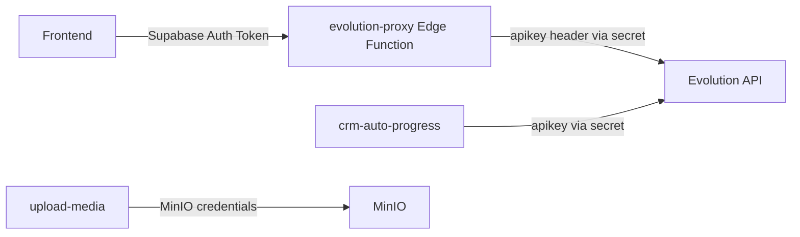
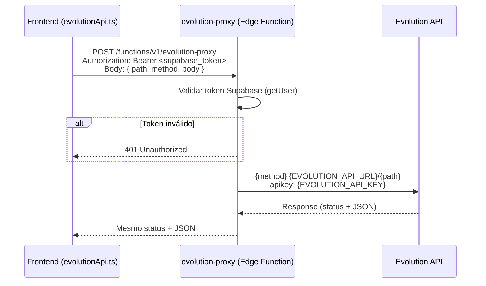

# Design — Refatoração de Qualidade de Código

## Visão Geral

Este documento descreve o design técnico para três melhorias críticas de qualidade no codebase iGreen:

1. **Proxy de Segurança**: Mover a chave da Evolution API do bundle frontend para uma Edge Function proxy no Supabase, eliminando a exposição de credenciais sensíveis.
2. **Type Safety**: Regenerar tipos TypeScript do Supabase e eliminar todos os casts `as any`, habilitando detecção de erros em tempo de compilação.
3. **Logging Configurável**: Criar um módulo Logger centralizado que substitui `console.log/error` diretos, com níveis configuráveis por ambiente.

Princípio fundamental: **zero breaking changes**. Todas as funções exportadas mantêm suas assinaturas. Todos os componentes consumidores continuam funcionando sem alteração. A Edge Function `crm-auto-progress` e `upload-media` não são modificadas.

## Arquitetura

### Estado Atual

```
Frontend (bundle JS) ──── VITE_EVOLUTION_API_KEY ────► Evolution API
                          (chave exposta no browser)
```

### Estado Proposto



O frontend deixa de conhecer a URL e a chave da Evolution API. Toda comunicação passa pela Edge Function `evolution-proxy`, que valida o token Supabase e injeta a `apikey` do secret.

### Fluxo de Requisição (Proxy)



## Componentes e Interfaces

### 1. Edge Function `evolution-proxy`

**Localização**: `supabase/functions/evolution-proxy/index.ts`

**Responsabilidade**: Receber requisições do frontend, validar autenticação Supabase, encaminhar para a Evolution API com a chave secreta, e retransmitir a resposta.

**Interface de entrada (request body)**:
```typescript
interface ProxyRequest {
  path: string;      // ex: "instance/create", "message/sendText/my-instance"
  method: string;    // "GET" | "POST" | "PUT" | "DELETE"
  body?: unknown;    // corpo JSON opcional para POST/PUT
}
```

**Comportamento**:
- Lê `EVOLUTION_API_URL` e `EVOLUTION_API_KEY` dos secrets do Supabase
- Valida o token JWT via `supabase.auth.getUser()`
- Constrói a URL: `${EVOLUTION_API_URL}/${path}`
- Encaminha com headers `Content-Type: application/json` e `apikey: ${EVOLUTION_API_KEY}`
- Retorna o mesmo status HTTP e corpo JSON da Evolution API
- CORS headers para permitir chamadas do frontend

**Respostas de erro**:
- `401`: Token Supabase ausente ou inválido
- `502`: Evolution API inacessível ou retornou erro

### 2. Refatoração de `evolutionApi.ts`

**Localização**: `src/services/evolutionApi.ts`

**Mudança**: A função interna `request()` deixa de chamar a Evolution API diretamente e passa a chamar a Edge Function `evolution-proxy` via Supabase client.

**Antes**:
```typescript
async function request<T>(url: string, options?: RequestInit): Promise<T> {
  const response = await fetch(url, {
    ...options,
    headers: { ...getHeaders(), ...options?.headers },
  });
  return handleResponse<T>(response);
}
```

**Depois**:
```typescript
async function request<T>(path: string, method: string, body?: unknown): Promise<T> {
  const session = await supabase.auth.getSession();
  const token = session.data.session?.access_token;
  const res = await fetch(`${SUPABASE_FUNCTIONS_URL}/evolution-proxy`, {
    method: "POST",
    headers: {
      "Content-Type": "application/json",
      Authorization: `Bearer ${token || SUPABASE_ANON_KEY}`,
      apikey: SUPABASE_ANON_KEY,
    },
    body: JSON.stringify({ path, method, body }),
  });
  return handleResponse<T>(res);
}
```

**Funções exportadas preservadas** (mesmas assinaturas):
- `createInstance`, `connectInstance`, `getConnectionState`, `deleteInstance`
- `findChats`, `findContacts`, `findMessages`
- `sendTextMessage`, `sendMedia`, `sendAudio`, `sendDocument`
- `markAsRead`, `getProfilePicture`, `getBase64FromMediaMessage`
- Tipos exportados: `EvolutionChat`, `EvolutionMessage`, `EvolutionContact`

**Arquivos consumidores que NÃO precisam mudar** (9 arquivos):
- `src/hooks/useChats.ts`
- `src/hooks/useMessages.ts`
- `src/hooks/useWhatsApp.ts`
- `src/components/whatsapp/ChatView.tsx`
- `src/components/whatsapp/BulkSendPanel.tsx`
- `src/components/whatsapp/KanbanBoard.tsx`
- `src/components/whatsapp/MessagePanel.tsx`
- `src/components/whatsapp/CustomerManager.tsx`
- `src/services/evolutionApi.test.ts` (atualizar mocks para novo formato)

### 3. Módulo Logger

**Localização**: `src/lib/logger.ts`

**Interface**:
```typescript
type LogLevel = "debug" | "info" | "warn" | "error";

interface Logger {
  debug(message: string, ...args: unknown[]): void;
  info(message: string, ...args: unknown[]): void;
  warn(message: string, ...args: unknown[]): void;
  error(message: string, ...args: unknown[]): void;
}

function createLogger(module: string): Logger;
```

**Comportamento**:
- Nível configurável via `VITE_LOG_LEVEL` (padrão: `"warn"` em produção, `"debug"` em dev)
- Em produção (`import.meta.env.PROD === true`), nível "debug" é desabilitado independente da config
- Cada mensagem inclui timestamp ISO e nome do módulo: `[2024-01-15T10:30:00.000Z] [useMessages] sending to: ...`
- Internamente usa `console.log` (debug/info), `console.warn` (warn), `console.error` (error)
- Logs de nível "error" sempre aparecem, mesmo em produção

**Hierarquia de níveis** (do mais verboso ao menos):
```
debug < info < warn < error
```
Se o nível configurado é "warn", apenas mensagens "warn" e "error" são emitidas.

**Substituições planejadas** (8 chamadas em 5 arquivos):

| Arquivo | Chamada atual | Nível Logger |
|---|---|---|
| `useMessages.ts` | `console.error("[useMessages] sendMessage: missing...")` | `error` |
| `useMessages.ts` | `console.log("[useMessages] sending to:...")` | `debug` |
| `useMessages.ts` | `console.log("[useMessages] message sent successfully")` | `debug` |
| `useMessages.ts` | `console.error("[useMessages] sendMessage error:...")` | `error` |
| `ChatView.tsx` | `console.error("[ChatView] Erro ao enviar áudio:...")` | `error` |
| `ChatView.tsx` | `console.error("[ChatView] Erro ao enviar mídia:...")` | `error` |
| `MessageComposer.tsx` | `console.error("[MessageComposer] Erro no upload:...")` | `error` |
| `minioUpload.ts` | `console.error("[MinIO Upload] Erro:...")` | `error` |
| `NotFound.tsx` | `console.error("404 Error:...")` | `warn` |

### 4. Regeneração de Tipos Supabase

**Comando**: `npx supabase gen types typescript --project-id zlzasfhcxcznaprrragl > src/integrations/supabase/types.ts`

**Impacto**: O arquivo `src/integrations/supabase/types.ts` será regenerado com todas as tabelas e colunas atuais do banco, incluindo colunas que foram adicionadas via migrations posteriores (ex: `auto_message_enabled`, `auto_message_type`, `auto_message_media_url`, `approved_at` em `crm_deals`, `licenciada_cadastro_url` em `consultants`).

### 5. Eliminação de `as any` (11 ocorrências em 6 arquivos)

| Arquivo | Linha | Cast atual | Solução |
|---|---|---|---|
| `KanbanBoard.tsx` | `.insert(inserts as any)` | Inserção de kanban_stages | Usar tipo `Database["public"]["Tables"]["kanban_stages"]["Insert"]` |
| `KanbanBoard.tsx` | `} as any)` (insert stage) | Inserção de stage individual | Idem |
| `KanbanBoard.tsx` | `.update({...} as any)` (label/color) | Update de stage | Usar tipo `...["Update"]` |
| `KanbanBoard.tsx` | `.update({...} as any)` (auto_message) | Update de auto_message | Idem |
| `KanbanBoard.tsx` | `.update({...} as any)` (enabled) | Update de enabled | Idem |
| `CustomerManager.tsx` | `.update(updateData as any)` | Update de customer | Usar tipo `...["customers"]["Update"]` |
| `CustomerManager.tsx` | `(result as any).profilePictureUrl` | Resposta da Evolution API | Tipar retorno de `getProfilePicture` corretamente |
| `AddCustomerDialog.tsx` | `.insert(insertData as any)` | Inserção de customer | Usar tipo `...["customers"]["Insert"]` |
| `Admin.tsx` | `(c as any).licenciada_cadastro_url` | Campo faltando no tipo | Resolvido pela regeneração de tipos |
| `useWhatsApp.ts` | `(response?.qrcode as any)?.pairingCode` | Resposta da Evolution API | Tipar interface de resposta do `createInstance` |
| `PixelInjector.tsx` | `noscript as any` | `appendChild(noscript)` | Cast para `Node` (tipo correto do DOM) |

Após regenerar os tipos do Supabase, a maioria dos casts em queries Supabase será eliminada naturalmente. Os casts restantes (Evolution API, DOM) requerem tipagem manual.

### 6. Configuração ESLint

Adicionar regra `@typescript-eslint/no-explicit-any: "error"` no `eslint.config.js` para prevenir novos usos de `any`.

## Modelos de Dados

### ProxyRequest (Edge Function)

```typescript
interface ProxyRequest {
  path: string;
  method: "GET" | "POST" | "PUT" | "DELETE";
  body?: unknown;
}
```

### Logger

```typescript
type LogLevel = "debug" | "info" | "warn" | "error";

const LOG_LEVEL_PRIORITY: Record<LogLevel, number> = {
  debug: 0,
  info: 1,
  warn: 2,
  error: 3,
};

interface Logger {
  debug(message: string, ...args: unknown[]): void;
  info(message: string, ...args: unknown[]): void;
  warn(message: string, ...args: unknown[]): void;
  error(message: string, ...args: unknown[]): void;
}
```

### Tipos Supabase (regenerados)

O tipo `Database` em `src/integrations/supabase/types.ts` será regenerado para incluir todas as tabelas e colunas atuais. As interfaces locais em `KanbanBoard.tsx` (`Deal`, `KanbanStage`) serão derivadas dos tipos gerados:

```typescript
import type { Database } from "@/integrations/supabase/types";

type KanbanStageRow = Database["public"]["Tables"]["kanban_stages"]["Row"];
type CrmDealRow = Database["public"]["Tables"]["crm_deals"]["Row"];
```

## Propriedades de Corretude

*Uma propriedade é uma característica ou comportamento que deve ser verdadeiro em todas as execuções válidas de um sistema — essencialmente, uma declaração formal sobre o que o sistema deve fazer. Propriedades servem como ponte entre especificações legíveis por humanos e garantias de corretude verificáveis por máquina.*

### Propriedade 1: Frontend roteia todas as chamadas via proxy

*Para qualquer* função exportada de `evolutionApi.ts` e qualquer conjunto de argumentos válidos, a requisição HTTP resultante deve ser direcionada à URL da Edge Function `evolution-proxy` (e não diretamente à Evolution API), e deve incluir o token de autenticação Supabase no header `Authorization`.

**Valida: Requisitos 1.2**

### Propriedade 2: Proxy adiciona apikey em todas as requisições encaminhadas

*Para qualquer* requisição válida recebida pela Edge Function `evolution-proxy` com token Supabase válido, a requisição encaminhada para a Evolution API deve conter o header `apikey` com o valor da variável de ambiente `EVOLUTION_API_KEY`, e o path e body devem ser preservados.

**Valida: Requisitos 1.3**

### Propriedade 3: Proxy rejeita requisições sem token Supabase válido

*Para qualquer* requisição recebida pela Edge Function `evolution-proxy` que não contenha um token Supabase válido (ausente, expirado ou malformado), a resposta deve ter status HTTP 401 e a requisição não deve ser encaminhada para a Evolution API.

**Valida: Requisitos 1.4, 1.5**

### Propriedade 4: Proxy retransmite respostas da Evolution API sem alteração

*Para qualquer* resposta da Evolution API (qualquer status HTTP e qualquer corpo JSON), a Edge Function `evolution-proxy` deve retransmitir ao frontend o mesmo status HTTP e o mesmo corpo JSON, sem modificação.

**Valida: Requisitos 1.7, 1.9**

### Propriedade 5: Logger filtra mensagens conforme nível configurado

*Para qualquer* nível de log configurado L e qualquer mensagem com nível M, a mensagem deve ser emitida se e somente se `prioridade(M) >= prioridade(L)`, onde a ordem de prioridade é `debug(0) < info(1) < warn(2) < error(3)`. Em ambiente de produção, mensagens de nível "debug" nunca devem ser emitidas independente da configuração.

**Valida: Requisitos 3.2, 3.3, 3.6**

### Propriedade 6: Logger inclui timestamp e contexto do módulo

*Para qualquer* mensagem de log emitida pelo Logger (em qualquer nível), a saída deve conter um timestamp no formato ISO 8601 e o nome do módulo/componente passado na criação do logger.

**Valida: Requisitos 3.5**

## Tratamento de Erros

### Edge Function `evolution-proxy`

| Cenário | Resposta |
|---|---|
| Token Supabase ausente/inválido | `401 { error: "Token de autenticação inválido ou ausente" }` |
| Evolution API inacessível (network error) | `502 { error: "Erro ao conectar com a API do WhatsApp" }` |
| Evolution API retorna erro (4xx/5xx) | Retransmite o mesmo status e corpo |
| Body da requisição inválido (path ausente) | `400 { error: "Campo 'path' é obrigatório" }` |
| Método OPTIONS (CORS preflight) | `200` com CORS headers |

### Frontend (`evolutionApi.ts`)

O tratamento de erros existente é preservado:
- `TypeError` (fetch failure) → `"Erro de conexão. Verifique sua internet."`
- Status `401` → `"Erro de autenticação com a API do WhatsApp"`
- Outros erros HTTP → `response.statusText`

### Logger

O Logger nunca lança exceções. Se `console.*` falhar internamente (cenário improvável), o erro é silenciosamente ignorado. O Logger não deve impactar o fluxo da aplicação.

## Estratégia de Testes

### Abordagem Dual: Testes Unitários + Testes de Propriedade

A cobertura de testes combina duas abordagens complementares:

- **Testes unitários** (Vitest): Exemplos específicos, edge cases e verificações de integração
- **Testes de propriedade** (fast-check + Vitest): Propriedades universais validadas com inputs gerados aleatoriamente

### Biblioteca de Property-Based Testing

**Biblioteca**: `fast-check` (compatível com Vitest, TypeScript nativo)

**Configuração**: Mínimo de 100 iterações por teste de propriedade.

**Formato de tag**: Cada teste de propriedade deve incluir um comentário referenciando a propriedade do design:
```typescript
// Feature: code-quality-refactor, Property 5: Logger filtra mensagens conforme nível configurado
```

### Testes Unitários Planejados

1. **evolution-proxy Edge Function**:
   - Rejeita requisição sem token (401)
   - Encaminha requisição válida e retorna resposta
   - Retorna 400 para body sem campo `path`

2. **evolutionApi.ts refatorado**:
   - Cada função exportada chama a URL do proxy (não a Evolution API)
   - Erro de rede produz mensagem correta
   - Atualizar mocks existentes em `evolutionApi.test.ts`

3. **Logger**:
   - `createLogger("test")` retorna objeto com debug/info/warn/error
   - Em nível "warn", debug e info são suprimidos
   - Em produção, debug é sempre suprimido
   - Mensagem de error sempre aparece

4. **Type Safety**:
   - Build compila sem erros (`tsc --noEmit`)
   - ESLint não reporta erros de `no-explicit-any`

### Testes de Propriedade Planejados

Cada propriedade de corretude (seção anterior) será implementada como um único teste de propriedade com fast-check:

| Propriedade | Gerador | Verificação |
|---|---|---|
| P1: Frontend roteia via proxy | Gerar nomes de instância e payloads aleatórios | URL da requisição aponta para proxy |
| P2: Proxy adiciona apikey | Gerar paths e bodies aleatórios | Header apikey presente na requisição encaminhada |
| P3: Proxy rejeita sem token | Gerar requisições com tokens inválidos/ausentes | Status 401, nenhuma chamada à Evolution API |
| P4: Proxy retransmite respostas | Gerar status codes e corpos JSON aleatórios | Resposta do proxy === resposta da Evolution API |
| P5: Logger filtra por nível | Gerar combinações de (nível config, nível mensagem) | Mensagem emitida ⟺ prioridade(msg) ≥ prioridade(config) |
| P6: Logger inclui metadata | Gerar nomes de módulo e mensagens aleatórias | Output contém timestamp ISO e nome do módulo |
