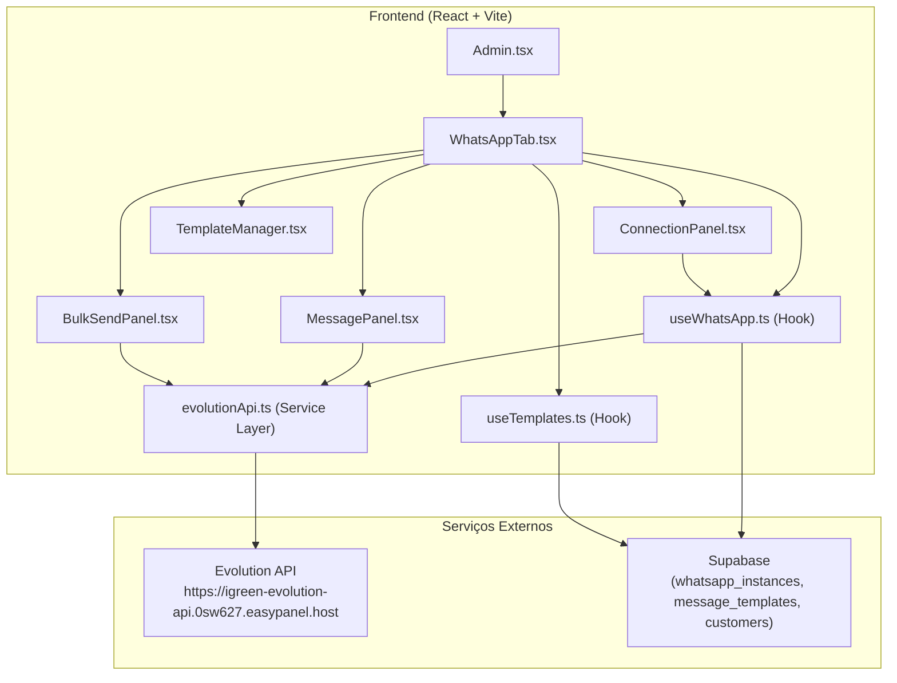
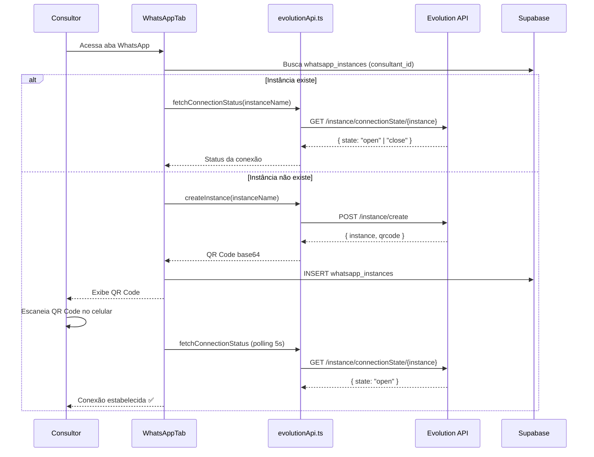

# Documento de Design — Integração WhatsApp via Evolution API

## Visão Geral

Esta funcionalidade integra a [Evolution API](https://doc.evolution-api.com/) ao Painel do Consultor da iGreen Energy, adicionando uma nova aba "WhatsApp" ao componente `Admin.tsx`. A integração permite que cada consultor conecte seu WhatsApp pessoal via QR Code e envie mensagens individuais ou em massa para seus clientes cadastrados na tabela `customers` do Supabase.

A comunicação com a Evolution API será feita via uma camada de serviço no frontend (`src/services/evolutionApi.ts`) que encapsula todas as chamadas HTTP. A API Key da Evolution API será armazenada como variável de ambiente (`VITE_EVOLUTION_API_KEY`) e a URL base como `VITE_EVOLUTION_API_URL`.

### Decisões de Design

1. **Chamadas diretas do frontend**: A Evolution API será chamada diretamente do frontend via fetch/axios, pois a API já está exposta publicamente com autenticação via API Key. Isso evita a complexidade de criar Edge Functions no Supabase como proxy.
2. **Persistência no Supabase**: O nome da instância Evolution e os templates de mensagem serão armazenados em novas tabelas no Supabase (`whatsapp_instances` e `message_templates`).
3. **Polling para status**: O status da conexão será verificado via polling a cada 30 segundos usando `setInterval` dentro de um hook React customizado.
4. **Envio sequencial com delay**: O envio em massa usará um loop sequencial com `setTimeout` de 2 segundos entre cada mensagem para evitar bloqueio pelo WhatsApp.

## Arquitetura



### Fluxo de Conexão WhatsApp



## Componentes e Interfaces

### Estrutura de Arquivos

```
src/
├── services/
│   └── evolutionApi.ts          # Camada de serviço para Evolution API
├── hooks/
│   ├── useWhatsApp.ts           # Hook para gerenciar conexão WhatsApp
│   └── useTemplates.ts          # Hook para gerenciar templates de mensagem
├── components/
│   └── whatsapp/
│       ├── WhatsAppTab.tsx       # Container principal da aba WhatsApp
│       ├── ConnectionPanel.tsx   # Painel de conexão (QR Code + status)
│       ├── MessagePanel.tsx      # Envio de mensagem individual
│       ├── BulkSendPanel.tsx     # Envio em massa
│       └── TemplateManager.tsx   # CRUD de templates
└── pages/
    └── Admin.tsx                 # (modificado) Adiciona aba WhatsApp
```

### Camada de Serviço — `evolutionApi.ts`

```typescript
// Endpoints da Evolution API utilizados
const EVOLUTION_API_URL = import.meta.env.VITE_EVOLUTION_API_URL;
const EVOLUTION_API_KEY = import.meta.env.VITE_EVOLUTION_API_KEY;

interface EvolutionApiService {
  // Instância
  createInstance(instanceName: string): Promise<{ instance: { instanceName: string; status: string }; qrcode: { base64: string } }>;
  connectInstance(instanceName: string): Promise<{ base64: string }>;
  getConnectionState(instanceName: string): Promise<{ state: "open" | "close" | "connecting" }>;
  deleteInstance(instanceName: string): Promise<void>;
  
  // Mensagens
  sendTextMessage(instanceName: string, phone: string, text: string): Promise<{ key: { id: string } }>;
}
```

**Endpoints da Evolution API utilizados:**

| Ação | Método | Endpoint | Body |
|------|--------|----------|------|
| Criar instância | POST | `/instance/create` | `{ instanceName, qrcode: true, integration: "WHATSAPP-BAILEYS" }` |
| Conectar (gerar QR) | GET | `/instance/connect/{instanceName}` | — |
| Status da conexão | GET | `/instance/connectionState/{instanceName}` | — |
| Deletar instância | DELETE | `/instance/delete/{instanceName}` | — |
| Enviar mensagem texto | POST | `/message/sendText/{instanceName}` | `{ number: "5511999999999", text: "mensagem" }` |

Todos os endpoints usam o header `apikey: {EVOLUTION_API_KEY}`.

### Hook `useWhatsApp`

```typescript
interface UseWhatsAppReturn {
  connectionStatus: "disconnected" | "connecting" | "connected";
  instanceName: string | null;
  qrCode: string | null;
  phoneNumber: string | null;
  isLoading: boolean;
  error: string | null;
  createAndConnect: () => Promise<void>;
  disconnect: () => Promise<void>;
  reconnect: () => Promise<void>;
}
```

### Hook `useTemplates`

```typescript
interface UseTemplatesReturn {
  templates: MessageTemplate[];
  isLoading: boolean;
  createTemplate: (name: string, content: string) => Promise<void>;
  deleteTemplate: (id: string) => Promise<void>;
  applyTemplate: (template: MessageTemplate, customer: Customer) => string;
}
```

### Componentes React

**WhatsAppTab**: Container principal. Renderiza `ConnectionPanel` sempre, e `MessagePanel`/`BulkSendPanel`/`TemplateManager` apenas quando `connectionStatus === "connected"`.

**ConnectionPanel**: Exibe QR Code quando desconectado/conectando. Exibe número conectado + badge verde + botão "Desconectar" quando conectado.

**MessagePanel**: Lista de clientes com busca, seleção de cliente, campo de texto, seletor de template, botão enviar.

**BulkSendPanel**: Lista de clientes com checkboxes, "Selecionar Todos", campo de mensagem, seletor de template, contagem de selecionados, barra de progresso durante envio, resumo ao final.

**TemplateManager**: Lista de templates salvos, formulário para criar novo template com nome e conteúdo, botão excluir com confirmação.

## Modelos de Dados

### Tabela `whatsapp_instances` (Supabase)

| Coluna | Tipo | Descrição |
|--------|------|-----------|
| `id` | uuid (PK) | Identificador único |
| `consultant_id` | uuid (FK → consultants.id) | Consultor dono da instância |
| `instance_name` | text (UNIQUE) | Nome da instância na Evolution API |
| `created_at` | timestamptz | Data de criação |

**RLS Policy**: Cada consultor só pode ler/escrever suas próprias instâncias (`auth.uid() = consultant_id`).

### Tabela `message_templates` (Supabase)

| Coluna | Tipo | Descrição |
|--------|------|-----------|
| `id` | uuid (PK) | Identificador único |
| `consultant_id` | uuid (FK → consultants.id) | Consultor dono do template |
| `name` | text | Nome do template |
| `content` | text | Conteúdo com placeholders (`{{nome}}`, `{{valor_conta}}`) |
| `created_at` | timestamptz | Data de criação |

**RLS Policy**: Cada consultor só pode ler/escrever seus próprios templates (`auth.uid() = consultant_id`).

### Tabela `customers` (existente)

Campos relevantes já existentes:
- `name`: Nome do cliente
- `phone_whatsapp`: Número do WhatsApp (formato: `5511999999999`)
- `electricity_bill_value`: Valor da conta de energia (usado no placeholder `{{valor_conta}}`)

### Tipos TypeScript

```typescript
interface WhatsAppInstance {
  id: string;
  consultant_id: string;
  instance_name: string;
  created_at: string;
}

interface MessageTemplate {
  id: string;
  consultant_id: string;
  name: string;
  content: string;
  created_at: string;
}

type ConnectionStatus = "disconnected" | "connecting" | "connected";

interface BulkSendProgress {
  total: number;
  sent: number;
  failed: number;
  inProgress: boolean;
}
```

### Variáveis de Ambiente (novas)

```env
VITE_EVOLUTION_API_URL=https://igreen-evolution-api.0sw627.easypanel.host
VITE_EVOLUTION_API_KEY=429683C4C977415CAAFCCE10F7D57E11
```

## Propriedades de Corretude

*Uma propriedade é uma característica ou comportamento que deve ser verdadeiro em todas as execuções válidas de um sistema — essencialmente, uma declaração formal sobre o que o sistema deve fazer. Propriedades servem como ponte entre especificações legíveis por humanos e garantias de corretude verificáveis por máquina.*

### Propriedade 1: Filtro de clientes retorna apenas resultados correspondentes

*Para qualquer* lista de clientes e *qualquer* string de busca não vazia, todos os clientes retornados pela função de filtro devem conter a string de busca (case-insensitive) no campo `name` ou no campo `phone_whatsapp`.

**Valida: Requisitos 3.6**

### Propriedade 2: Substituição de placeholders em templates

*Para qualquer* template contendo placeholders `{{nome}}` e/ou `{{valor_conta}}`, e *para qualquer* cliente com `name` e `electricity_bill_value` definidos, a função `applyTemplate` deve retornar uma string onde nenhuma ocorrência de `{{nome}}` ou `{{valor_conta}}` permanece, e o nome do cliente e o valor da conta aparecem no resultado.

**Valida: Requisitos 5.2, 5.3**

### Propriedade 3: Persistência round-trip de templates

*Para qualquer* template com nome e conteúdo válidos (não vazios), após salvar no banco de dados e consultar de volta, o nome e conteúdo retornados devem ser idênticos aos valores originais.

**Valida: Requisitos 5.1, 5.4**

### Propriedade 4: Persistência round-trip de instância WhatsApp

*Para qualquer* consultant_id e instance_name válidos, após salvar o registro da instância no banco de dados e consultar de volta pelo consultant_id, o instance_name retornado deve ser idêntico ao valor original.

**Valida: Requisitos 7.1**

### Propriedade 5: Selecionar todos e contagem de selecionados

*Para qualquer* lista de clientes com N elementos, ao acionar "Selecionar Todos", o número de clientes selecionados deve ser igual a N, e a contagem exibida deve ser igual a N.

**Valida: Requisitos 4.3, 4.4**

### Propriedade 6: Completude do envio em massa

*Para qualquer* lista de clientes selecionados com N elementos, após a conclusão do envio em massa, a soma de mensagens enviadas com sucesso e mensagens com falha deve ser igual a N.

**Valida: Requisitos 4.5, 4.7**

## Tratamento de Erros

| Cenário | Comportamento | Componente |
|---------|---------------|------------|
| Falha ao criar instância na Evolution API | Exibe toast de erro com mensagem descritiva + botão "Tentar novamente" | ConnectionPanel |
| QR Code expirado | Exibe botão "Gerar novo QR Code" que chama `connectInstance` | ConnectionPanel |
| Conexão perdida (polling detecta `state: "close"`) | Toast informativo + muda UI para estado desconectado com botão "Reconectar" | useWhatsApp |
| Instância salva no DB mas não existe na Evolution API | Remove registro local do Supabase + exibe tela de nova conexão | useWhatsApp |
| Falha ao enviar mensagem individual | Toast de erro com descrição da falha da API | MessagePanel |
| Falha parcial no envio em massa | Continua enviando para os próximos; no final exibe resumo com contagem de sucesso/falha | BulkSendPanel |
| Envio em massa sem clientes selecionados | Exibe aviso "Selecione pelo menos um destinatário" e bloqueia o envio | BulkSendPanel |
| Mensagem vazia ao tentar enviar | Botão "Enviar" desabilitado quando campo de texto está vazio | MessagePanel, BulkSendPanel |
| Erro de rede (fetch falha) | Toast genérico "Erro de conexão. Verifique sua internet." | evolutionApi.ts |
| Evolution API retorna 401 (API Key inválida) | Toast "Erro de autenticação com a API do WhatsApp" | evolutionApi.ts |

## Estratégia de Testes

### Abordagem Dual

A estratégia de testes combina testes unitários e testes baseados em propriedades (property-based testing):

- **Testes unitários**: Verificam exemplos específicos, edge cases e condições de erro
- **Testes de propriedade**: Verificam propriedades universais em muitas entradas geradas aleatoriamente
- Ambos são complementares e necessários para cobertura abrangente

### Biblioteca de Property-Based Testing

Será utilizada a biblioteca **fast-check** (`fc`) para TypeScript/JavaScript, que já é compatível com o Vitest configurado no projeto.

### Configuração dos Testes de Propriedade

- Mínimo de 100 iterações por teste de propriedade
- Cada teste deve referenciar a propriedade do design com um comentário no formato:
  `// Feature: evolution-whatsapp-integration, Property {N}: {título}`

### Testes Unitários

| Teste | Componente | Tipo |
|-------|------------|------|
| Cria instância e retorna QR code | evolutionApi.ts | Exemplo |
| Retorna erro quando criação falha | evolutionApi.ts | Exemplo |
| Desconecta e deleta instância | evolutionApi.ts | Exemplo |
| Exibe QR Code quando desconectado | ConnectionPanel | Exemplo |
| Exibe status verde quando conectado | ConnectionPanel | Exemplo |
| Exibe botão reconectar quando desconectado com instância existente | ConnectionPanel | Exemplo |
| Não permite envio com mensagem vazia | MessagePanel | Edge case |
| Não permite envio em massa sem seleção | BulkSendPanel | Edge case |
| Exclui template após confirmação | TemplateManager | Exemplo |
| Limpa instância local quando não existe na Evolution API | useWhatsApp | Edge case |

### Testes de Propriedade

| Propriedade | Teste | Iterações |
|-------------|-------|-----------|
| Propriedade 1 | `// Feature: evolution-whatsapp-integration, Property 1: Filtro de clientes retorna apenas resultados correspondentes` | 100 |
| Propriedade 2 | `// Feature: evolution-whatsapp-integration, Property 2: Substituição de placeholders em templates` | 100 |
| Propriedade 3 | `// Feature: evolution-whatsapp-integration, Property 3: Persistência round-trip de templates` | 100 |
| Propriedade 4 | `// Feature: evolution-whatsapp-integration, Property 4: Persistência round-trip de instância WhatsApp` | 100 |
| Propriedade 5 | `// Feature: evolution-whatsapp-integration, Property 5: Selecionar todos e contagem de selecionados` | 100 |
| Propriedade 6 | `// Feature: evolution-whatsapp-integration, Property 6: Completude do envio em massa` | 100 |
