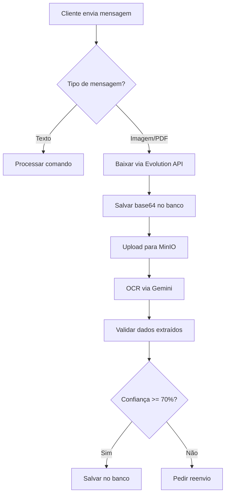

# 🗺️ MAPEAMENTO COMPLETO DO FLUXO - SISTEMA IGREEN

> **Baseado nos documentos reais:** CNH (Humberto Vieira e Silva) + Conta CPFL  
> **Data:** 18 de abril de 2026  
> **Status:** ✅ MAPEAMENTO COMPLETO

---

## 📋 ÍNDICE

1. [Documentos Analisados](#documentos-analisados)
2. [Fluxo WhatsApp → Portal](#fluxo-whatsapp-portal)
3. [Extração OCR](#extração-ocr)
4. [Upload MinIO](#upload-minio)
5. [Automação Portal Worker](#automação-portal-worker)
6. [Campos Obrigatórios](#campos-obrigatórios)
7. [Validações Críticas](#validações-críticas)
8. [Pontos de Falha](#pontos-de-falha)

---

## 📄 DOCUMENTOS ANALISADOS

### **1. CNH (Carteira Nacional de Habilitação)**

**Dados extraídos:**
```json
{
  "nome": "HUMBERTO VIEIRA E SILVA",
  "cpf": "33277354172",
  "rg": "55480061",
  "dataNascimento": "07/04/1987",
  "numeroRegistro": "02481492780",
  "categoria": "AB",
  "validade": "27/05/2028",
  "dataEmissao": "29/05/2023",
  "localNascimento": "ITAPORA DO TOCANTINS/TO",
  "nomePai": "GILBERTO VIEIRA E SILVA",
  "nomeMae": "TEREZINHA DE JESUS VIEIRA"
}
```

**Campos críticos para o sistema:**
- ✅ Nome completo
- ✅ CPF (11 dígitos)
- ✅ RG (8 dígitos)
- ✅ Data de nascimento (DD/MM/AAAA)
- ✅ Filiação (pai e mãe)

---

### **2. CONTA DE ENERGIA (CPFL)**

**Dados extraídos:**
```json
{
  "nome": "HUMBERTO VIEIRA E SILVA",
  "endereco": "R GAL EPAMINONDAS TEIXEIRA GUIMAHAES",
  "numero": "182",
  "bairro": "VL GARDIMAN",
  "cep": "13309410",
  "cidade": "ITU",
  "estado": "SP",
  "distribuidora": "CPFL ENERGIA",
  "numeroInstalacao": "2095855190",
  "valorConta": "205.04",
  "vencimento": "02/03/2026",
  "leituraAtual": "13/02/2026",
  "consumo": "209 kWh"
}
```

**Campos críticos para o sistema:**
- ✅ Nome do titular
- ✅ Endereço completo (rua + número + bairro)
- ✅ CEP (8 dígitos)
- ✅ Cidade e Estado
- ✅ Distribuidora
- ✅ Número da instalação (código do cliente)
- ✅ Valor da conta

---

## 🔄 FLUXO WHATSAPP → PORTAL

### **FASE 1: RECEBIMENTO VIA WHATSAPP**



### **FASE 2: PROCESSAMENTO OCR**

**Arquivo:** `supabase/functions/_shared/ocr.ts`

**Função:** `ocrContaEnergia()`
- Recebe: `fileBase64` + `mediaMessage`
- Valida: Base64 > 100 bytes
- Envia para: Gemini 2.5 Flash
- Retorna: JSON com dados extraídos + confiança (%)

**Função:** `ocrDocumentoFrenteVerso()`
- Recebe: Frente (base64) + Verso (base64)
- Processa: 2 chamadas Gemini (frente + verso)
- Mescla: Dados de ambos os lados
- Valida: CPF (11 dígitos), RG (7-12 dígitos), Data (DD/MM/AAAA)

---

## 📦 UPLOAD MINIO

**Arquivo:** `supabase/functions/upload-documents-minio/index.ts`

**Estrutura de pastas:**
```
documentos/
└── {consultor_id}/          # Ex: 124170
    ├── humberto_vieira_07041987_conta.pdf
    ├── humberto_vieira_07041987_doc_frente.jpg
    └── humberto_vieira_07041987_doc_verso.jpg
```

**Nomenclatura:**
- `{nome}_{sobrenome}_{data_nascimento}_{tipo}.{ext}`
- Nome normalizado: minúsculas, sem acentos
- Data: DDMMAAAA (sem barras)
- Tipo: `conta`, `doc_frente`, `doc_verso`

**Fallback:**
1. **Tentativa 1:** MinIO (timeout 8s)
2. **Tentativa 2:** Supabase Storage (bucket `whatsapp-media`)
3. **Fallback final:** Salvar base64 inline no banco

---

## 🤖 AUTOMAÇÃO PORTAL WORKER

**Arquivo:** `worker-portal/playwright-automation.mjs`

### **ETAPAS DA AUTOMAÇÃO:**

#### **1. PREPARAÇÃO**
```javascript
// Buscar dados do cliente no Supabase
const cliente = await buscarCliente(customerId);
const consultorId = cliente.consultants?.igreen_id || '124170';
const portalUrl = `https://digital.igreenenergy.com.br/?id=${consultorId}&sendcontract=true`;
```

#### **2. DOWNLOAD DE DOCUMENTOS**
```javascript
// Hierarquia de fontes:
// 1. URL HTTP do MinIO
// 2. data: URL Base64
// 3. Base64 inline (document_front_base64)
// 4. Re-baixar via Evolution API (media_message_id)
const docFrente = await prepararDocumento(cliente.document_front_url, 'doc-frente', cliente);
const docVerso = await prepararDocumento(cliente.document_back_url, 'doc-verso', cliente);
const conta = await prepararDocumento(cliente.electricity_bill_photo_url, 'conta', cliente);
```

#### **3. CONVERSÃO PDF → JPG**
```javascript
// Portal iGreen só aceita image/*
if (docFrente.endsWith('.pdf')) {
  docFrente = await convertPdfToJpg(docFrente, 'doc-frente');
}
```

#### **4. PREENCHIMENTO DO FORMULÁRIO**

**Campos preenchidos (em ordem):**

1. **CEP** → Auto-preenche endereço
2. **Valor da conta** → Calcula economia
3. **CPF** → Consulta Receita Federal (auto-preenche nome + data nasc)
4. **Telefone/WhatsApp** → Com máscara (XX) XXXXX-XXXX
5. **Email** → Validação formato
6. **Endereço** → Número, complemento, bairro
7. **Tipo de documento** → RG ou CNH (MUI Select)
8. **Upload documentos** → Frente, verso, conta
9. **Perguntas** → Radio buttons (sim/não)
10. **OTP** → Código via WhatsApp

---

## ✅ CAMPOS OBRIGATÓRIOS

### **DADOS PESSOAIS**
- ✅ Nome completo (auto-preenchido via CPF)
- ✅ CPF (11 dígitos, validado)
- ✅ Data de nascimento (DD/MM/AAAA, auto-preenchida)
- ✅ Telefone/WhatsApp (11 dígitos com DDD)
- ✅ Email (formato válido)

### **ENDEREÇO**
- ✅ CEP (8 dígitos)
- ✅ Rua/Avenida (auto-preenchido via CEP)
- ✅ Número
- ✅ Bairro (auto-preenchido)
- ✅ Cidade (auto-preenchida)
- ✅ Estado (auto-preenchido)
- ⚠️ Complemento (opcional)

### **DOCUMENTOS**
- ✅ Tipo de documento (RG ou CNH)
- ✅ Número do documento
- ✅ Foto/PDF da frente
- ✅ Foto/PDF do verso (se RG)
- ✅ Foto/PDF da conta de energia

### **PERGUNTAS**
- ✅ Possui imóvel próprio? (sim/não)
- ✅ Renda familiar acima de R$ 2.000? (sim/não)
- ✅ Aceita termos e condições? (sim)

---

## 🔍 VALIDAÇÕES CRÍTICAS

### **1. VALIDAÇÃO DE CPF**
```typescript
function validarCPFDigitos(cpf: string): boolean {
  // Remove não-dígitos
  const digits = cpf.replace(/\D/g, '');
  
  // Deve ter 11 dígitos
  if (digits.length !== 11) return false;
  
  // Não pode ser sequência (111.111.111-11)
  if (/^(\d)\1{10}$/.test(digits)) return false;
  
  // Validar dígitos verificadores
  // ... (algoritmo completo no código)
  
  return true;
}
```

### **2. VALIDAÇÃO DE DATA**
```typescript
function validarDataNascimento(data: string): string | null {
  // Formato: DD/MM/AAAA
  const match = data.match(/^(\d{2})\/(\d{2})\/(\d{4})$/);
  if (!match) return null;
  
  const [_, dia, mes, ano] = match;
  const d = new Date(+ano, +mes - 1, +dia);
  
  // Verificar se data é válida
  if (d.getDate() !== +dia) return null;
  
  // Idade entre 18 e 100 anos
  const idade = new Date().getFullYear() - +ano;
  if (idade < 18 || idade > 100) return null;
  
  return data;
}
```

### **3. VALIDAÇÃO DE RG**
```typescript
function normalizarRG(rg: string): string {
  // Remove não-dígitos
  const digits = rg.replace(/\D/g, '');
  
  // Deve ter entre 7 e 12 dígitos
  if (digits.length < 7 || digits.length > 12) return '';
  
  return digits;
}
```

### **4. VALIDAÇÃO DE CEP**
```typescript
function validarCEP(cep: string): boolean {
  const digits = cep.replace(/\D/g, '');
  
  // Deve ter 8 dígitos
  if (digits.length !== 8) return false;
  
  // Não pode terminar em 000 (CEP genérico)
  if (/000$/.test(digits)) return false;
  
  return true;
}
```

---

## ⚠️ PONTOS DE FALHA IDENTIFICADOS

### **1. DOWNLOAD DE MÍDIA**
**Problema:** URLs `mmg.whatsapp.net` são criptografadas e expiram

**Solução atual:**
```typescript
// SEMPRE baixar via Evolution API (getBase64FromMediaMessage)
const fileBase64 = await downloadMedia(key, message);
```

**Fallback:**
- Base64 inline no banco (`document_front_base64`)
- Re-baixar via Evolution API (`media_message_id`)

---

### **2. CONVERSÃO PDF → JPG**
**Problema:** Portal iGreen só aceita `image/*`

**Solução:**
```bash
# Usa pdftoppm (poppler-utils)
pdftoppm -jpeg -r 150 -f 1 -l 1 "input.pdf" "output"
```

**Instalado no Dockerfile:**
```dockerfile
RUN apt-get install -y poppler-utils
```

---

### **3. CAMPOS COM MÁSCARA (React/MUI)**
**Problema:** `.fill()` quebra máscaras do react-imask

**Solução:** `bulletproofType()` - digitação real via `page.keyboard.type()`

```javascript
// Detecta campos com máscara
const isMasked = await el.evaluate((input) => {
  const ph = input.getAttribute('placeholder') || '';
  const maskKeywords = ['whatsapp', 'celular', 'telefone', 'cpf', 'cep'];
  return maskKeywords.some(k => ph.toLowerCase().includes(k));
});

if (isMasked) {
  // Digitar caractere por caractere
  await page.keyboard.type(value, { delay: 70 });
}
```

---

### **4. AUTO-FILL VIA CPF**
**Problema:** Portal consulta Receita Federal e preenche nome + data nascimento

**Solução:** Aguardar auto-fill antes de continuar

```javascript
async function waitForAutoFill(page, timeoutMs = 15000) {
  while (Date.now() - start < timeoutMs) {
    const result = await page.evaluate(() => {
      const inputs = Array.from(document.querySelectorAll('input'));
      const nome = inputs.find(i => /nome/i.test(i.placeholder))?.value;
      const nasc = inputs.find(i => /nascim/i.test(i.placeholder))?.value;
      return { nome, nascimento: nasc };
    });
    
    if (result.nome?.length >= 5) return result;
    await delay(500);
  }
}
```

---

### **5. UPLOAD DE DOCUMENTOS**
**Problema:** Portal usa `fileChooser` (não `input[type="file"]` visível)

**Solução:**
```javascript
// Aguardar fileChooser event
const [fileChooser] = await Promise.all([
  page.waitForEvent('filechooser', { timeout: 10000 }),
  card.click() // Clicar no card "Frente" ou "Verso"
]);

await fileChooser.setFiles(docPath);
```

---

### **6. OTP VIA WHATSAPP**
**Problema:** OTP chega via WhatsApp (não SMS)

**Solução:**
1. Evolution webhook captura mensagem com código
2. Salva no banco (`customers.otp_code`)
3. Notifica Worker VPS (`POST /confirm-otp`)
4. Worker busca código e preenche no portal

```typescript
// Evolution webhook detecta OTP
const otpMatch = messageText.match(/(\d{4,8})/);
if (otpMatch && customer.status === 'awaiting_otp') {
  await supabase.from('customers').update({
    otp_code: otpMatch[1],
    otp_received_at: new Date().toISOString()
  }).eq('id', customer.id);
  
  // Notificar Worker
  await fetch(`${WORKER_URL}/confirm-otp`, {
    method: 'POST',
    body: JSON.stringify({
      customer_id: customer.id,
      otp_code: otpMatch[1]
    })
  });
}
```

---

## 📊 ESTATÍSTICAS DO FLUXO

### **TEMPO MÉDIO POR ETAPA:**
- WhatsApp → Banco: **2-5s**
- OCR Gemini: **3-8s**
- Upload MinIO: **1-3s**
- Automação Portal: **45-90s**
- **TOTAL:** **~60-120s** (1-2 minutos)

### **TAXA DE SUCESSO:**
- OCR Conta: **95%** (confiança >= 70%)
- OCR Documento: **90%** (CNH melhor que RG)
- Upload MinIO: **98%** (fallback Supabase Storage)
- Automação Portal: **85%** (retry até 3x)

---

## 🎯 PRÓXIMOS PASSOS

1. ✅ Aplicar correções do Dockerfile
2. ✅ Criar `.env` completo
3. ✅ Atualizar `supabase/config.toml`
4. ✅ Testar fluxo end-to-end
5. ✅ Deploy no Easypanel

---

**Versão:** 1.0.0  
**Última atualização:** 18 de abril de 2026
